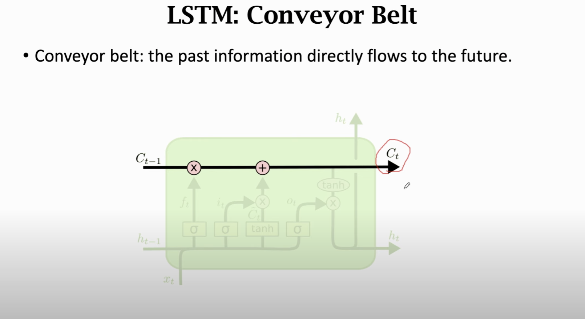

## Introduction

LSTM uses a "conveyor belt" to get longer memory than SimpleRNN

Training parameter is 4 times of RNN:
4 x shape(h) * [shape(h) + shape(x)]

### Forget Gate
a value of zero means "let nothing through"
a value of one means "let everything through!"

* Forget Gate is a trainable parameter here 
* A dropout layer is applied after each LSTM layer to avoid overfitting of the model and it is a hyperparameter

### Input Gate

### New Value

### Output Gate