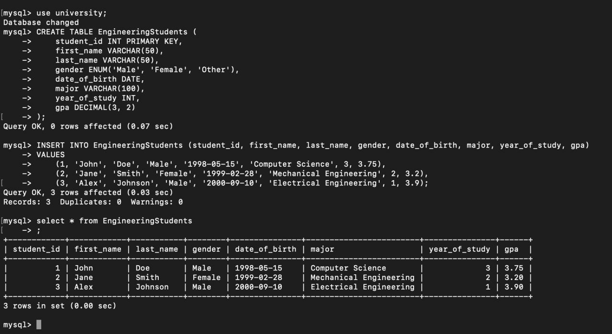
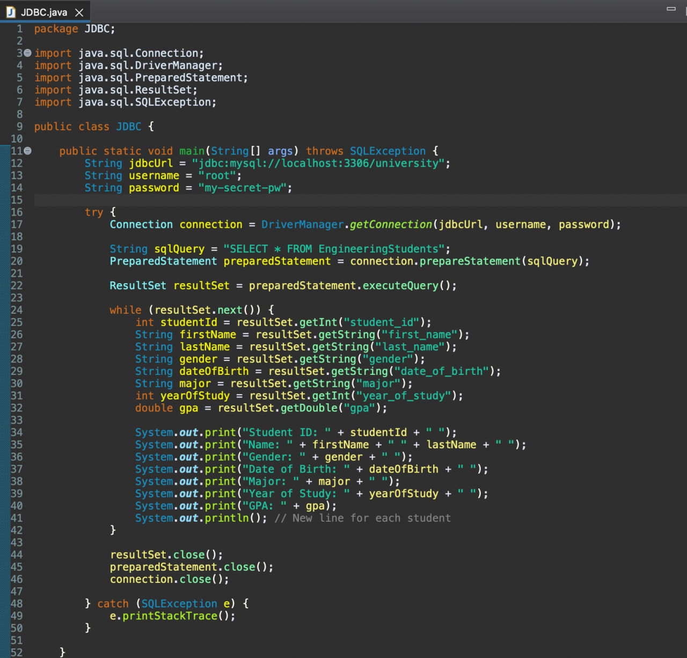

## Introduction

This is my simple notes for Java JDBC connection.

## Environment

1. Eclipse IDE: Version: 2023-06 (4.28.0)
2. openjdk version "20.0.1" 2023-04-18, OpenJDK Runtime Environment Homebrew (build 20.0.1)
3. MySQL in Docker: Ver 8.1.0 for Linux on aarch64 (MySQL Community Server - GPL)

## Setup for MySQL DB

assume docker is installed on the machine, then run MySQL instance in the background

```
docker run --name some-mysql -e MYSQL_ROOT_PASSWORD=my-secret-pw -d mysql:latest  -p 3306:3306
```

you can verify if the DB setup correctly or not using `docker ps -a`


then you could get into the container by

```
docker exec -it some-mysql sh
```

then connect to MySQL using cmd

```
mysql -u root -p my-secret-pw
```

try to create a database called `university` and use the database

```
create database university;
...
...
use university;
```

then create a table, let's say `EngineeringStudents`

```
CREATE TABLE EngineeringStudents (
    ->     student_id INT PRIMARY KEY,
    ->     first_name VARCHAR(50),
    ->     last_name VARCHAR(50),
    ->     gender ENUM('Male', 'Female', 'Other'),
    ->     date_of_birth DATE,
    ->     major VARCHAR(100),
    ->     year_of_study INT,
    ->     gpa DECIMAL(3, 2)
    -> );
```

and insert some student records

```
mysql> INSERT INTO EngineeringStudents (student_id, first_name, last_name, gender, date_of_birth, major, year_of_study, gpa)
    -> VALUES
    ->     (1, 'John', 'Doe', 'Male', '1998-05-15', 'Computer Science', 3, 3.75),
    ->     (2, 'Jane', 'Smith', 'Female', '1999-02-28', 'Mechanical Engineering', 2, 3.2),
    ->     (3, 'Alex', 'Johnson', 'Male', '2000-09-10', 'Electrical Engineering', 1, 3.9);
```

finally, try to get all the records

```

mysql> select * from EngineeringStudents;
+------------+------------+-----------+--------+---------------+------------------------+---------------+------+
| student_id | first_name | last_name | gender | date_of_birth | major                  | year_of_study | gpa  |
+------------+------------+-----------+--------+---------------+------------------------+---------------+------+
|          1 | John       | Doe       | Male   | 1998-05-15    | Computer Science       |             3 | 3.75 |
|          2 | Jane       | Smith     | Female | 1999-02-28    | Mechanical Engineering |             2 | 3.20 |
|          3 | Alex       | Johnson   | Male   | 2000-09-10    | Electrical Engineering |             1 | 3.90 |
+------------+------------+-----------+--------+---------------+------------------------+---------------+------+
3 rows in set (0.00 sec)

```

Here is the screenshot you may expect to see


## Run a simple program on Eclipse

Here I have a simple java code on Eclipse


Try to run the program, and here we try to use create and delete operation on a new student record using java JDBC SQL. And finally can list the student records from database.

