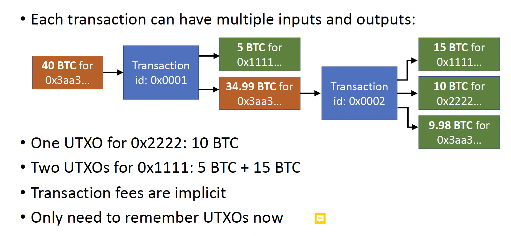

# UTXO

UTXO stands for Unspent Transaction Output. UTXOs represent units of cryptocurrency that have been received by an address and are available to be spent in future transactions.

## How UTXO Works

1. UTXO as a Record: In a UTXO-based system, every transaction consists of inputs and outputs. The outputs of a transaction that have not been spent (i.e., used as inputs in another transaction) are stored as UTXOs. Each UTXO can be thought of as a record of a certain amount of cryptocurrency tied to a specific address.

2. Immutable and Stateless: UTXOs are immutable once they are created.

## What Happens When a User Transfers Money?

1. Selecting UTXOs: The user's wallet software selects one or more UTXOs that belong to the user's address to fund the transaction. The total value of the selected UTXOs must be at least equal to the amount the user wants to transfer plus any transaction fees.

2. Creating Inputs: The selected UTXOs are referenced as inputs in the new transaction. Each input includes the transaction ID of the UTXO being spent, an index to identify the specific output from that transaction, and a cryptographic signature that proves the user's ownership.

3. Creating Outputs: The transaction specifies one or more outputs, which detail how the cryptocurrency is to be distributed. Each output includes the amount of cryptocurrency and the recipient's address (typically a public key or hashed public key).

example:

1. in this example, 40 btc utxo is completely spent and new UTXO (34.99 btc) are created
2. for address 0x1111, even it receives btc, it comes with new utxo instead of appending the balance into the first utxo
