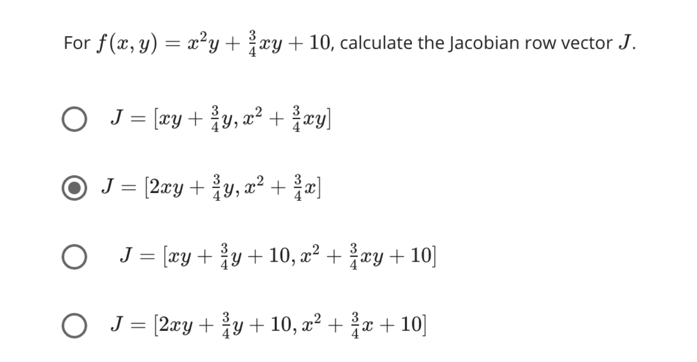
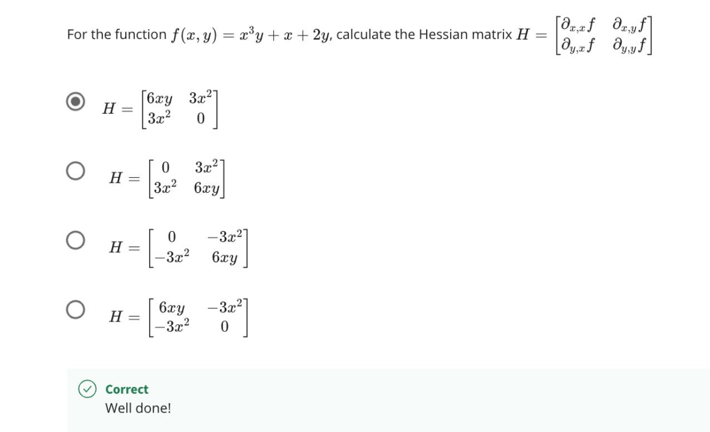

## derivative-of-tan

http://www.intuitive-calculus.com/derivative-of-tan.html

## chain rule example

```
f(x) = e^(sin(x^2))
dx/df = df/dg * dg/dh * dh/dx
​
f(g) = e^g, f'(x) = e^g
g(h) = sin(h), g'(h) = cos(h)
h(x) = x^2, h'(x) = 2x

dh/dx = 2x
dg/dh = cos(2x)
df/dg = e^(sin^x2)

dx/df = 2xe * e^(sin^x2) * cos(2x)
```

## Jacobian

The Jacobian matrix represents the differential of f at every point where f is differentiable.

J = [2xy,x^2,3]
j(0,0,0) = [2 * 0 * 0, 0^2,3] = [0,0,3]



## The Hessian

https://www.khanacademy.org/math/multivariable-calculus/applications-of-multivariable-derivatives/quadratic-approximations/a/the-hessian


