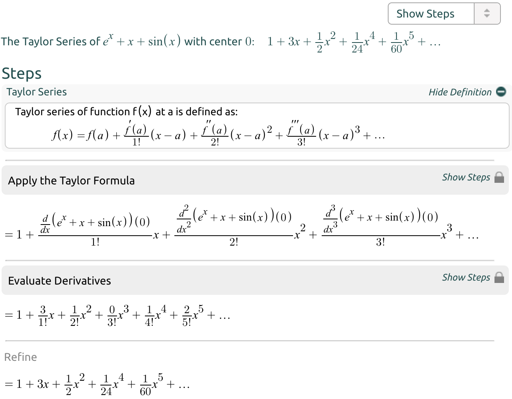

## Why Use The Taylor Series?

The Taylor series can be used if our function is way too complex for our computer to use. Take for example we have a function that has terms that reach a power of 100. Our computer would take ages to calculate that kind of function on a lot of data. If we only care about a certain domain such as x = -2 up to x = 2 for example, then we wouldn't need the entire function at all and an approximate would do. If we have a Taylor series of say, up to the third order and it already captures x = -2 until x =2 accurately, then we would have a good approximate already and that could be used by our computer instead.

ref:
https://www.coursera.org/learn/multivariate-calculus-machine-learning/discussions/weeks/4/threads/8INglvKoEemFlAqMnv19UA



## Order approximation

More order approximate, more accurated

ref: https://www.coursera.org/learn/multivariate-calculus-machine-learning/discussions/weeks/4/threads/XiEPYYhuQyOhD2GIbrMjLQ

## TAYLOR AND MACLAURIN (POWER) SERIES CALCULATOR

https://www.emathhelp.net/en/calculators/calculus-1/taylor-and-maclaurin-series-calculator/?f=1%2Fx&p=4&n=5&v=

https://www.symbolab.com/solver/series-absolute-convergence-calculator

## Inflection points

Points where slop f'(x) stop decreasing

https://www.khanacademy.org/math/ap-calculus-ab/ab-diff-analytical-applications-new/ab-5-6a/v/inflection-points#:~:text=Inflection%20points%20are%20points%20where,the%20second%20derivative%20changes%20signs

## q2-3 ans

https://www.coursera.org/learn/multivariate-calculus-machine-learning/discussions/weeks/4/threads/RZI30a1lQwmSN9GtZQMJJQ

## q4-4

```
the point is to use the chain rule to get the df/dx and df/dy, then apply the values (-1,2) in the expression:

take a = -x^4 - 1/2 y^2

f'x = df(x,y)/dx = -(4x^4 - 1)y^2 e^a)   = Jfx

find  df(x,y)/dy = f'y = Jfy

recall the linearization formula: f(x + Dx, y + Dy) = f(x) + JfxDx + JfyDy

if you don´t mess with the derivative, you´ll get f'x(-1,2) = -12e^-3 and f'y = 4e^-3.
```

ref: https://www.coursera.org/learn/multivariate-calculus-machine-learning/discussions/weeks/4/threads/XiEPYYhuQyOhD2GIbrMjLQ

## q4-5

```
fx(x,y) = cos(phi * x -x^2 *y)(phi - 2yx)
fy(x,y) = cos(phi * x -x^2 *y) (-x^2)

fxx(x,y) = -sin(phi * x -x^2 *y) (-2y)
fxy(x,y) = -sin(phi * x -x^2 *y) (-2x)

fyx(x,y) = -sin(phi * x -x^2 *y) (-2x)
fyy(x,y) = -sin(phi * x -x^2 *y) (0)
```

H_f = [[-2 phi, -2],[-2,0]]

## q5-1

order 1: one straight line with slope
order 2: one turning point (slope = 0)
order 6: 5 turning points

ref: https://www.khanacademy.org/math/ap-calculus-bc/bc-series-new/bc-10-14/v/visualizing-taylor-series-approximations
