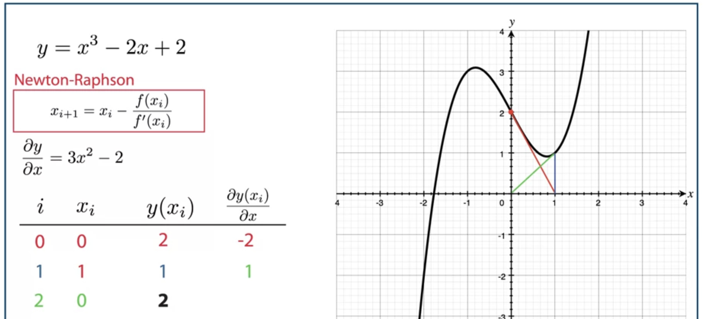

## Newton-Raphson

find the convergence point gradually

x_x+i = x_i - f(x_i)/f'(x_i)

### Problems

1. x never become value between 0 and 1
2. gradient (f'(x_i)) could be very small and x_i could be very large
