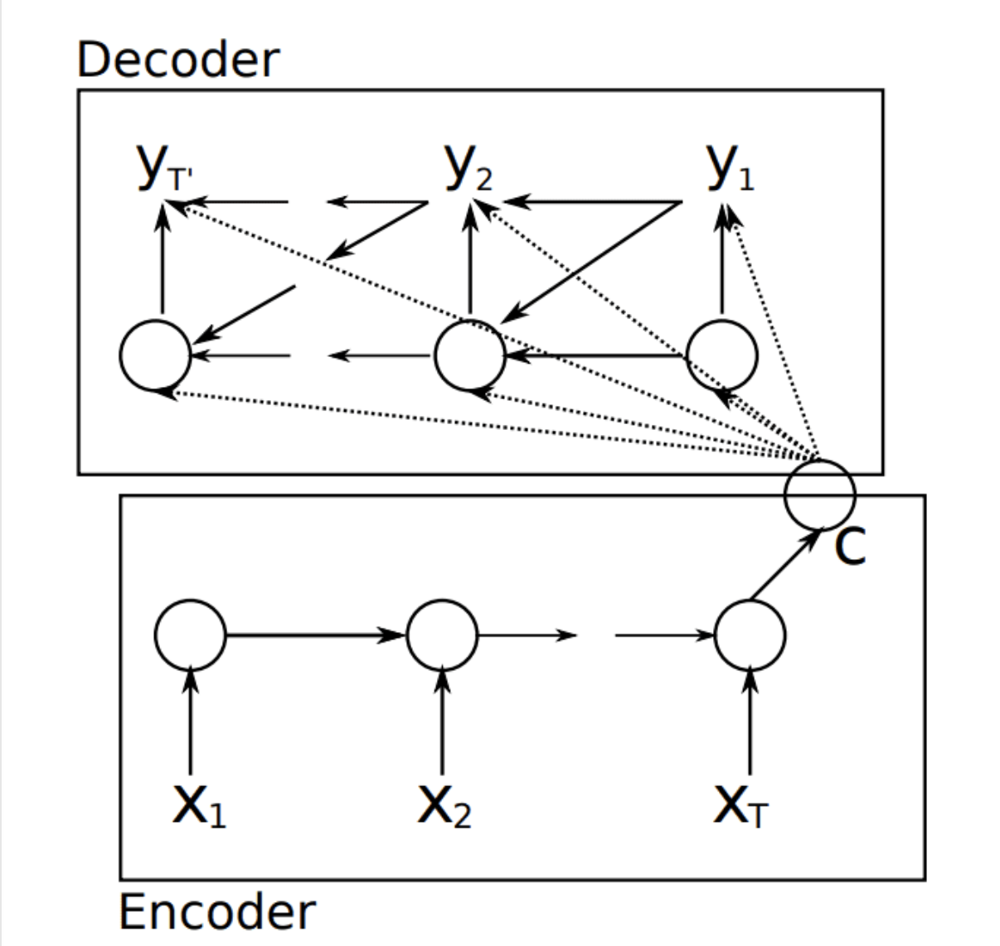

# Summary

## Seq2Seq + Attention



1. decoder hidden layer (s_j) should contain all information of the sentence
2. calculate a_i from h_i and s_j, the sum of a_m should be 1 (original approach)
    * a_i = v_T * tanh[W * [h_i , s_j]], v_T and W are trainable parameters
    * [a_1,.... a_m] = softmax([a_1,.... a_m])
3. calculate a_i from h_i and s_j (new approach)
    * k_i = W_k * h_i
    * q_j = W_q * s_j
    * a_i = k_i.Transpose * q_j  
    * [a_1,.... a_m] = softmax([a_1,.... a_m])
4. calculate context vector c_j
    * c_j = a_0 * h_0 + .... a_i * h_i
5. s_j+1 will be calcuated from [y_i,  s_j, c_j] // as s_j depend on c_j-1, so it know the whole sentence and hence it won't forget like rnn

so that we know foreach input x_i, what is the weighting of it (a_i) to the whole sentence (s_j)

### Advantages
1. Standard Seq2Seq model: the decoder looks at only its current state. Attention: decoder additionally looks at all the states of the encoder.
3. attention: decoder knows where to focus

### Disadvantages
1. insenstivite to ordering

ref: 
https://zhuanlan.zhihu.com/p/43493999
https://www.youtube.com/watch?v=XhWdv7ghmQQ


## Transformer

ref:
https://zhuanlan.zhihu.com/p/53682800

## Reformer


### Hashing attention (for time complexity)

1. Select a ramdon projection with several buckets
2. Project input vectors to the project
3. similiar vectors should be place into the same buckets

so instead of calculate all weighting in a sentence, just calculate the word with similar vector

### Reversible Transformer (for memory complexity)

calculate and using the same memory space

```
def backward_pass(y1, y2, d_y1, d_y2, Wf, Wg):
    """
    Pseudocode for RevNet of backward pass
    
    y1: one half of layer output
    y2: second half of layer output
    d_y1: derivative of y1
    d_y2: derivative of y2
    Wf: weights that parameterize function f
    Wg: weights that parameterize function g
    """
    z1 = y1
    
    # Extra computation -- the price we pay for memory
    # complexity that doesn't scale with n_layers
    # Importantly this means we don't have to store x1 or x2!
    x2 = y2 - g(Wg, z1)
    x1 = y1 - f(Wf, x2)

```

x1, x2 = x[0:len(x)/2], x[len(x)/2:]

we calculate them when needed instead of storing them


ref: 
* https://zhuanlan.zhihu.com/p/115741192
* https://www.6aiq.com/article/1583729200869
