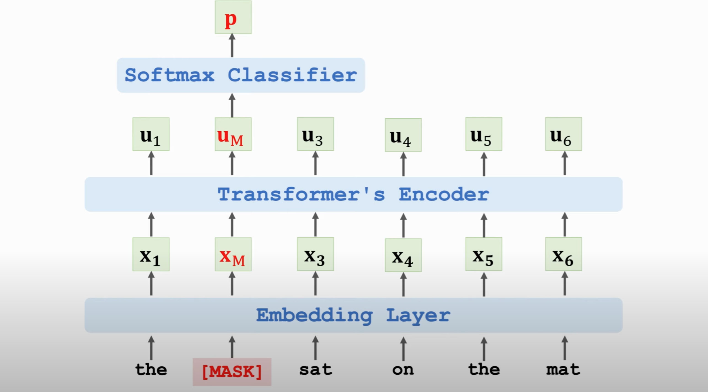
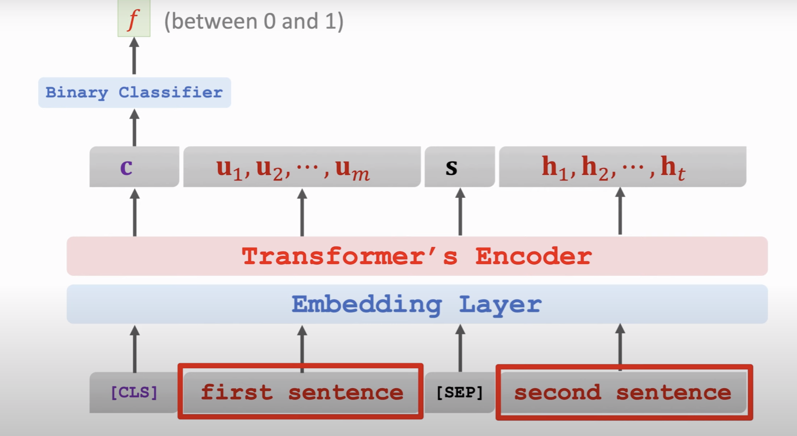

# Summary

## Seq2Seq + Attention


1. decoder hidden layer (s_j) should contain all information of the sentence
2. calculate a_i from h_i and s_j, the sum of a_m should be 1 (h_i is the encoder hidden state) (simple attention)
   - a_i = v_T \* tanh[W \_ [h_i , s_j]], v_T and W are trainable parameters
   - [a_1,.... a_m] = softmax([a_1,.... a_m])
3. calculate context vector c_j
   - c*j = a_0 * h*0 + .... a_i * h_i
4. s_j+1 will be calcuated from [y_i, s_j, c_j] // as s_j+1 depend on c_j, so it know the whole sentence and hence it won't forget like rnn

so that we know foreach input x_i, what is the weighting of it (a_i) to the whole sentence (s_j)

### Advantages

1. Standard Seq2Seq model: the decoder looks at only its current state. Attention: decoder additionally looks at all the states of the encoder.
2. attention: decoder knows where to focus

### Disadvantages

1. insenstivite to ordering

ref:
https://zhuanlan.zhihu.com/p/43493999
https://www.youtube.com/watch?v=XhWdv7ghmQQ

2. Higher time complexity

```
   m: source sequence length
   t: target sequence length
   standard Seq2Seq: (m+t) time complexity
   Seq2Seq + attention: O(mt) time complexity (every decoder hidden state (t) will look every decoder hidden state (m))
```

## Transformer

ref:
https://zhuanlan.zhihu.com/p/53682800

https://www.youtube.com/watch?v=aButdUV0dxI&t=50s

### self attention layer(only input)

ref: https://www.youtube.com/watch?v=mMa2PmYJlCo

```
Q: W_q * x
K: W_k * x
V: W_v * x

Attention Filter = softmax(MatMul(Q,K.transpose) / √(d_K)) # here we can do paralle calculation
Attention(Q,K,V) = Attention Filter * V
```

### multiHead:

https://towardsdatascience.com/transformers-explained-visually-part-3-multi-head-attention-deep-dive-1c1ff1024853

```
MultiHead (Q,K,V) = Concat (selfAtten 1 ,…, selfAtten h)W O
```

This means that separate sections of the Embedding can learn different aspects of the meanings of each word, as it relates to other words in the sequence. This allows the Transformer to capture richer interpretations of the sequence.

### attention layer (input, target)

```
key: k_i = W * input
query: q_j = W * target


for each q in q_j
    a_j = []
    for each k in k_j
        a_j[i] = k.transpose \* q
    a_j = softmax(a_j)
c_j = a_0_j * v_0 + ... a_i_j * v_i
```

we can calculate c_j parallelly


### why Multi-head Attention?

capture more feature, but it doesn't have a conclusion yet

## BERT (Bidrectional Encoder Representations from Transformers)

BERT is for pre-training Transformer's encoder

- Predict masked word
- Predict next sentence

### Predict masked word



### Predict next sentence



embedding layer can learn the relationship between the two sentences

### pros

- bert does not need manually labeled data (manual labeling is expensive)
- any large-scale data can be used as training data, e.g., english wikipedia

## cons

- cost greate memory usage, as too many traing parameters. BERT base has 110M parameters. 16TPUs need 4 days of training without hyper-parameter tuning

## Reformer

### Hashing attention (for time complexity)

1. Select a ramdon projection with several buckets
2. Project input vectors to the project
3. similiar vectors should be place into the same buckets

so instead of calculate all weighting in a sentence, just calculate the word with similar vector

### Reversible Transformer (for memory complexity)

calculate and using the same memory space

```
def backward_pass(y1, y2, d_y1, d_y2, Wf, Wg):
    """
    Pseudocode for RevNet of backward pass

    y1: one half of layer output
    y2: second half of layer output
    d_y1: derivative of y1
    d_y2: derivative of y2
    Wf: weights that parameterize function f
    Wg: weights that parameterize function g
    """
    z1 = y1

    # Extra computation -- the price we pay for memory
    # complexity that doesn't scale with n_layers
    # Importantly this means we don't have to store x1 or x2!
    x2 = y2 - g(Wg, z1)
    x1 = y1 - f(Wf, x2)

```

x1, x2 = x[0:len(x)/2], x[len(x)/2:]

we calculate them when needed instead of storing them

ref:

- https://zhuanlan.zhihu.com/p/115741192
- https://www.6aiq.com/article/1583729200869
