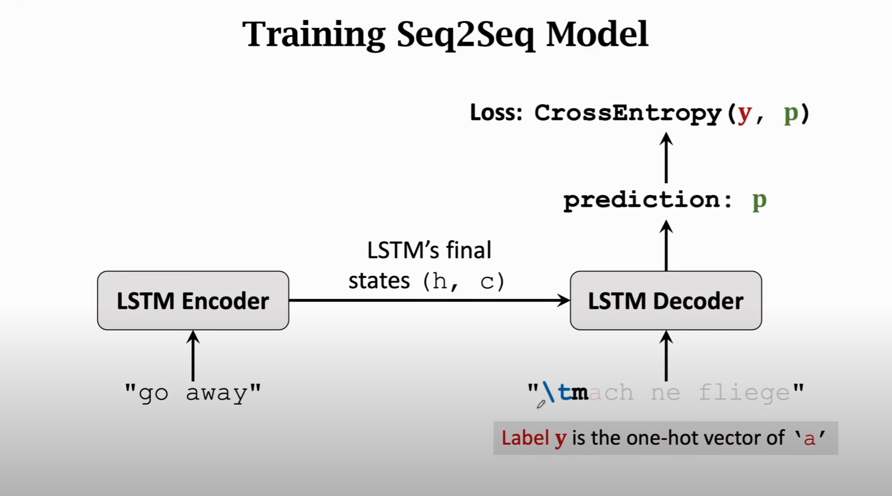

## Seq2Seq Model

 

`A` means weighting

 

`tanh function` will reset the value of ht between -1 and 1 in every iteration, so that the weighting `A` won't be close to 0 or infinitity.

## Shortcomings

input 1 (first word) almost irrelvant to h100 state, which is not reasonable in RNN

## Parameters

